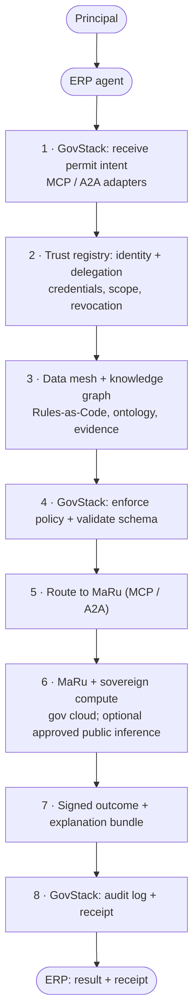

# Aruait system overview

> Workshop draft. This document is intentionally opinionated and incomplete so the engineering team can debate trust boundaries, sovereignty, and vendor lock-in before implementation commitments are made.

Aruait is designed as a sovereign governance layer for an agentic state, not as a single conversational assistant. The architecture assumes agents negotiate over intents, policies, evidence, and delegated authority through open protocols, while public institutions retain control of trust, rules, and high-assurance execution paths.

> For a **diagram-only workshop page** (same Mermaid and extension table), open [System overview workshop diagram](03-system-overview-workshop.md). The narrative and diagram also stay inline here for GitHub Pages and review in one place. When you edit the graph or table, update **both** files so they stay aligned.

<!-- Initial draft for workshop debate. The point is to surface trust and portability questions early, not to lock the programme into one cloud, registry, or model vendor. -->

## Hybrid decentralized interaction view

The diagram is a **single vertical spine** so previews stay narrow and scrollable. Per-step **extensions** (inputs on the left of the narrative, outputs on the right) live in the table under the diagram — Mermaid subgraph rows tended to stagger and become unreadable in Cursor.

| Step | Left (inputs / constraints) | Right (outputs / artifacts) |
| --- | --- | --- |
| **S1** | Delegated filing mandate; human or business context | Ingress checks; size, rate, tenant routing; normalized envelope |
| **S2** | Caller keys and handles; DID; attestation hints | Trust decision; active, in-scope, not revoked; VC chain verified |
| **S3** | Ruleset and case refs; jurisdiction; service domain | Policy bundle; schemas; evidence checklist |
| **S4** | Intent versus rules diff; negotiable versus fixed constraints | Gate outcome; allow, counter-offer, or deny |
| **S5** | Target capability map; MaRu agent and tool profile | Signed handoff; envelope and correlation |
| **S6** | Case payload and evidence; attachments; cadastre refs | Execution trace; gov runtime and optional approved model burst |
| **S7** | Decision record; approve, reject, or conditions | Explainability pack; rule and policy citations |
| **S8** | Append-only ledger slot; hash chain; timestamps | Verifier payload; receipt id; replay-safe token |

## ERP to MaRu interaction flow

1. **GovStack** (`S1`, `S4`, `S5`, `S8`) is the orchestration layer: secure routing, MCP or A2A adaptation, policy enforcement, and signed audit output.
2. **Trust registry** (`S2`) verifies machine identity, delegation scope, credential chain, and revocation before execution proceeds.
3. **Data mesh and knowledge graph** (`S3`) supply Rules-as-Code, permit ontology, and evidence expectations for the case.
4. **MaRu and sovereign compute** (`S6`) run the permit workflow primarily on government cloud infrastructure; public cloud model inference appears only where policy allows low-sensitivity work (collapsed into one node to keep the diagram narrow).
5. The ERP agent receives a **signed outcome** and **audit receipt** suitable for enterprise records and later verification.

## Notes for the workshop

1. The orchestration layer is a control plane, not the sole place where intelligence lives; the system remains decentralized because agency and enterprise agents retain local autonomy.
2. The trust registry is the zero-trust phonebook for machine identities, delegation scopes, and revocation status.
3. The data mesh keeps authoritative rules and evidence schemas close to the institutions that own them, while the knowledge graph provides shared semantics for negotiation.
4. The sovereign compute core separates high-assurance public execution from commodity inference so the programme can avoid unnecessary vendor lock-in.
