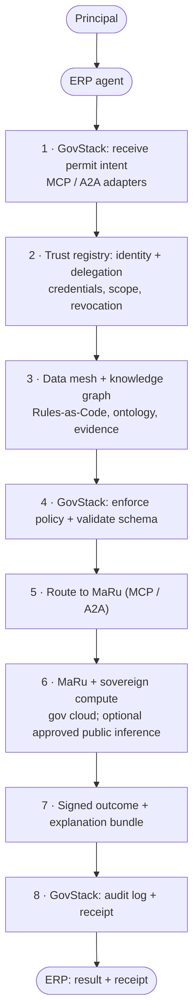

# Aruait system overview — workshop diagram

Companion to [System overview](01-system-overview.md): same Mermaid graph and extension table in a file you can open alone for Markdown preview during workshops. When you change the diagram or table, update **both** this file and `01-system-overview.md` so they stay in sync.

If the preview still shows an **old diagram** after saving, run **Command Palette → Developer: Reload Window** — some editors cache Mermaid output.

The graph stays a **single vertical spine** so previews stay narrow and scrollable. **Extensions** (left and right of each step in the narrative) are in the table below.

| Step | Left (inputs / constraints) | Right (outputs / artifacts) |
| --- | --- | --- |
| **S1** | Delegated filing mandate; human or business context | Ingress checks; size, rate, tenant routing; normalized envelope |
| **S2** | Caller keys and handles; DID; attestation hints | Trust decision; active, in-scope, not revoked; VC chain verified |
| **S3** | Ruleset and case refs; jurisdiction; service domain | Policy bundle; schemas; evidence checklist |
| **S4** | Intent versus rules diff; negotiable versus fixed constraints | Gate outcome; allow, counter-offer, or deny |
| **S5** | Target capability map; MaRu agent and tool profile | Signed handoff; envelope and correlation |
| **S6** | Case payload and evidence; attachments; cadastre refs | Execution trace; gov runtime and optional approved model burst |
| **S7** | Decision record; approve, reject, or conditions | Explainability pack; rule and policy citations |
| **S8** | Append-only ledger slot; hash chain; timestamps | Verifier payload; receipt id; replay-safe token |

## Reading guide

1. **GovStack** steps (`S1`, `S4`, `S5`, `S8`) are the orchestration layer: routing, protocols, policy, and audit.
2. **S2** is the agent / trust registry (machine identity and delegation).
3. **S3** is the data mesh and knowledge graph (rules and semantics).
4. **S6** is sovereign compute: primary execution on government cloud, with public cloud only for approved low-sensitivity model work.
5. Scenario: ERP requests a **building permit** from **MaRu**; the enterprise agent gets a **signed result and audit receipt**.

## Workshop note

This draft is intentionally opinionated and incomplete so the team can debate trust boundaries, sovereignty, and vendor lock-in before implementation commitments are made.
